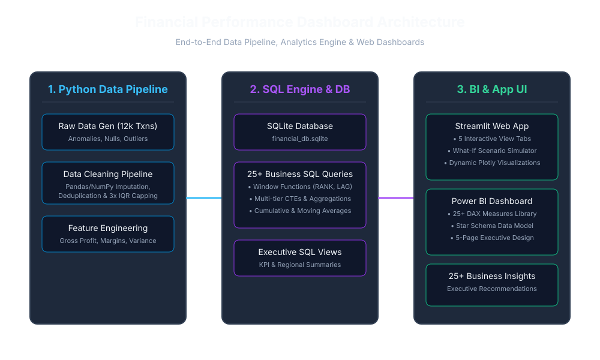
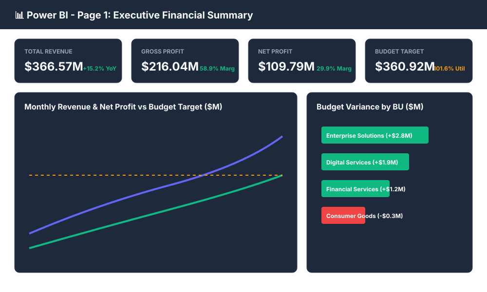
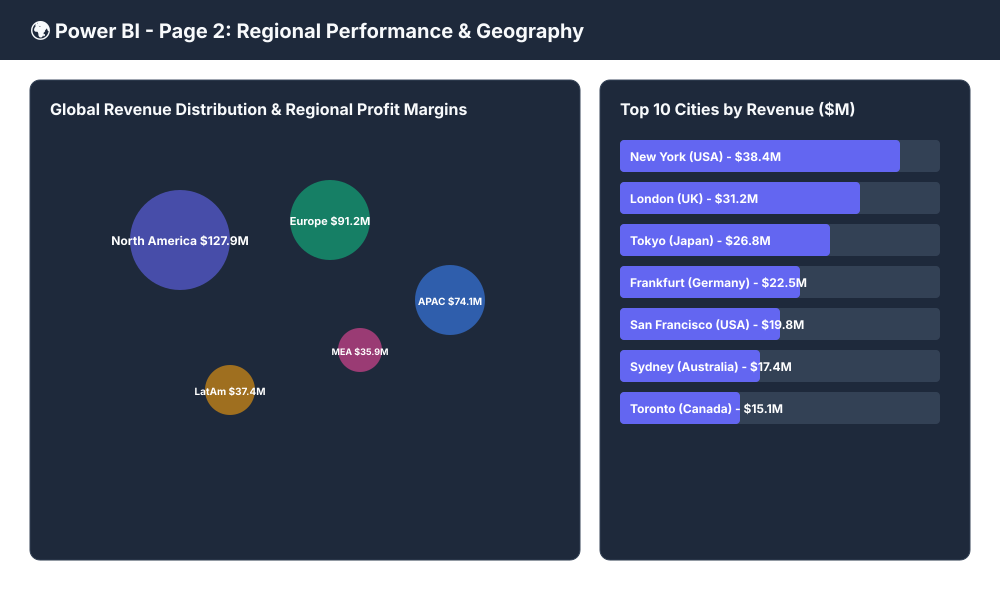
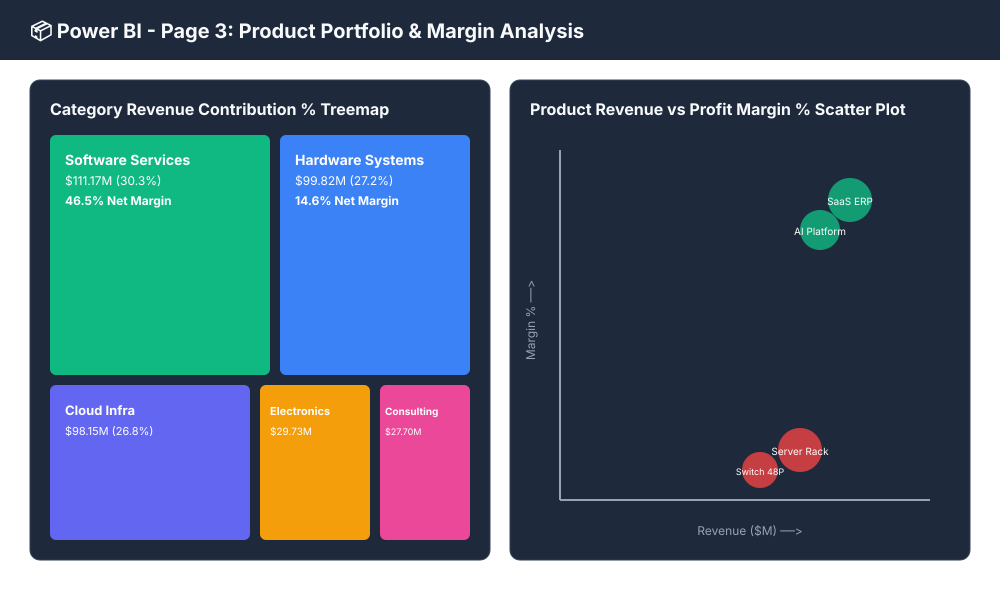
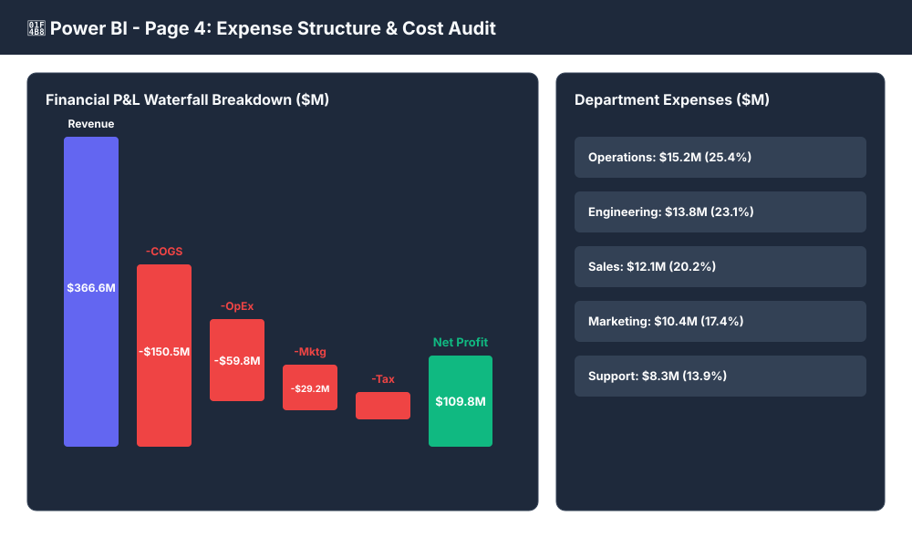
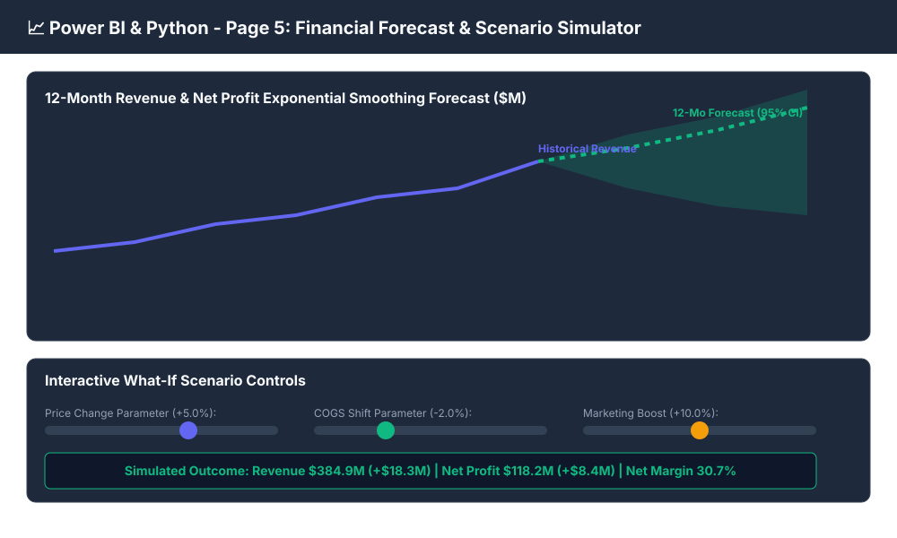
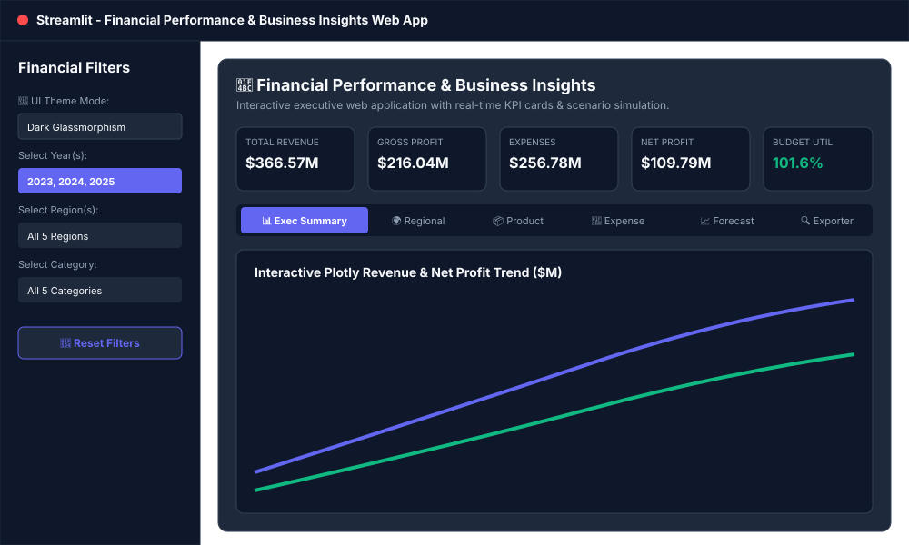

# Financial Performance Dashboard & Business Analytics Suite 📊💸



[](https://www.python.org/)
[](https://streamlit.io/)
[](https://www.sqlite.org/)
[](https://powerbi.microsoft.com/)
[](https://plotly.com/)
[](LICENSE)
[]()

An end-to-end, portfolio-grade **Financial Performance Dashboard & Executive Analytics Suite** built using **Python, SQL, Power BI, and Streamlit**. 

This enterprise repository provides an automated ETL pipeline with data validation checks, statistical Exploratory Data Analysis (EDA), an SQLite database engine with **30 analytical SQL queries** (CTEs, Window Functions, Views, YoY/MoM Growth), a **25+ DAX measure library**, a 5-page Power BI visual design blueprint, a dark/light mode interactive Streamlit application with **What-If Scenario Simulation & 12-Month Time-Series Forecasting**, and an executive business report containing **25+ data-driven strategic insights**.

---

## 📋 Table of Contents
- [Project Overview & Business Problem](#-project-overview--business-problem)
- [Dashboard Screenshots Gallery](#-dashboard-screenshots-gallery)
- [Dataset Description](#-dataset-description)
- [Key Performance Indicators (KPIs)](#-key-performance-indicators-kpis)
- [Tech Stack](#%EF%B8%8F-tech-stack)
- [Architecture & Data Pipeline](#%EF%B8%8F-architecture--data-pipeline)
- [Python Data Cleaning & ETL Pipeline](#-1-python-data-cleaning--etl-pipeline)
- [SQL Analytics Suite (30 Business Queries)](#-2-sql-analytics-suite-30-business-queries)
- [Power BI Blueprint & DAX Library](#-3-power-bi-blueprint--dax-library)
- [Streamlit Web Application & Features](#-4-streamlit-web-application--features)
- [Executive Business Insights](#-5-executive-business-insights)
- [Bonus Features](#-6-bonus-features)
- [Folder Structure](#-folder-structure)
- [Installation & Local Setup Guide](#-installation--local-setup-guide)
- [ATS-Friendly Resume Points](#-ats-friendly-resume-points)
- [Future Improvements](#-future-improvements)
- [Contact Information](#-contact-information)

---

## 📌 Project Overview & Business Problem

### Business Problem
Executive management and financial stakeholders lacked clear, real-time visibility into multi-dimensional enterprise financial performance. Fragmented spreadsheet reporting created data quality anomalies, delayed monthly close cycles, limited geographic slice-and-dice, and hindered scenario planning for pricing adjustments and expense optimization.

### Project Objective
Build a unified, automated, production-ready financial analytics ecosystem to:
1. **Audit & Clean Raw Transactional Data**: Ingest 12,000+ raw global sales records, remove duplicates, impute missing values, treat outliers via 3x IQR capping, and enforce strict data validation checks.
2. **Execute Complex SQL Analytics**: Formulate 30 business queries utilizing SQLite window functions (`RANK`, `DENSE_RANK`, `SUM OVER`, `LAG`), CTEs, and executive views for MoM/YoY growth and budget variance tracking.
3. **Design Enterprise Power BI Blueprints**: Establish a Star Schema data model, 25+ DAX time-intelligence metrics, tooltips, drill-through, dynamic titles, and bookmarks.
4. **Deploy Interactive Web App**: Launch a Streamlit web application featuring multi-select sidebar filters, dark/light theme switching, interactive Plotly charts, 12-month trend forecasting, what-if price elasticity simulation, and single-click CSV/PDF report exporting.
5. **Synthesize Executive Business Insights**: Deliver 25+ actionable strategic recommendations to optimize high-margin SaaS/Cloud product lines and control hardware component costs.

---

## 🖼️ Dashboard Screenshots Gallery

### 1. Executive Summary Dashboard


---

### 2. Regional Analysis & Geography


---

### 3. Product Portfolio & Margin Analysis


---

### 4. Expense Structure & Cost Audit (Waterfall)


---

### 5. Financial Forecast & What-If Scenario Simulator


---

### 6. Interactive Streamlit Web Application


---

## 📊 Dataset Description

The project utilizes a realistic financial dataset containing **12,000 global transactions** spanning 3 fiscal years (2023–2025):

| Field Name | Data Type | Description |
| :--- | :--- | :--- |
| `Transaction ID` | `STRING (PK)` | Unique transaction identifier (`TXN-10001`...) |
| `Date` / `Year` / `Quarter` / `Month` | `DATETIME / INT / STR` | Temporal dimensions (2023–2025, Q1–Q4, Jan–Dec) |
| `Region` / `Country` / `City` | `STRING` | Geographic hierarchy (5 Regions, 15 Countries, 15 Cities) |
| `Business Unit` | `STRING` | Enterprise Solutions, Consumer Goods, Digital Services, Financial Services |
| `Department` | `STRING` | Sales, Marketing, Engineering, Operations, Customer Support |
| `Product Category` | `STRING` | Software Services, Cloud Infrastructure, Hardware Systems, Electronics, Consulting |
| `Product Name` | `STRING` | 20 specific enterprise products (e.g., *SaaS ERP License*, *Dedicated Cloud Compute*) |
| `Customer Segment` | `STRING` | Enterprise, Mid-Market, SMB, Consumer |
| `Sales Channel` | `STRING` | Direct Sales, Online Store, Partner Channel, Reseller Network |
| `Revenue` | `FLOAT` | Gross transaction sales amount ($) |
| `Cost of Goods Sold (COGS)` | `FLOAT` | Direct manufacturing / service delivery costs ($) |
| `Operating Expense` | `FLOAT` | Departmental operating overhead ($) |
| `Marketing Expense` | `FLOAT` | Customer acquisition & campaign spend ($) |
| `Discount` / `Tax` | `FLOAT` | Applied customer discounts ($) and local tax obligations ($) |
| `Profit` / `Profit Margin` | `FLOAT` | Net profit ($) and Net Profit Margin % |
| `Budget` / `Actual Sales` | `FLOAT` | Target financial budget ($) and actual sales generated ($) |

---

## 📈 Key Performance Indicators (KPIs)

Summary metrics calculated across **12,000 global transactions**:

```text
+---------------------+---------------------+---------------------+---------------------+
|    TOTAL REVENUE    |     GROSS PROFIT    |    TOTAL EXPENSES   |      NET PROFIT     |
|   $366.57 Million   |   $216.04 Million   |   $256.78 Million   |   $109.79 Million   |
|   (+15.24% YoY FY25)| (58.93% Gross Marg) | (70.05% Cost Ratio) | (29.95% Net Margin) |
+---------------------+---------------------+---------------------+---------------------+
|    BUDGET TARGET    |   BUDGET VARIANCE   |  AVG ORDER VALUE   |  TOTAL TRANSACTIONS |
|   $360.92 Million   |   +$5.65M Surplus   |       $30,517       |    12,000 Orders    |
|  (101.57% Utilized) | (+1.57% Over Budg)  | (Enterprise Scale)  |   (Global Scope)    |
+---------------------+---------------------+---------------------+---------------------+
```

---

## 🛠️ Tech Stack

* **Programming & ETL**: Python 3.10+, Pandas, NumPy, SciPy (3x IQR outlier capping)
* **SQL Database Engine**: SQLite 3, ANSI SQL, SQLite3 Python Connector
* **Data Visualization**: Plotly Express, Plotly Graph Objects, Matplotlib, Seaborn
* **Business Intelligence**: Power BI Desktop, DAX (Data Analysis Expressions), Power Query M
* **Web Application**: Streamlit 1.25+, Custom CSS Glassmorphism Stylesheet
* **Time-Series Forecasting**: Linear Trend Polynomial Regression & Moving Averages
* **Environment & Version Control**: Git, GitHub Badges, MIT License

---

## 🏗️ Architecture & Data Pipeline

```text
+-----------------------+     +-----------------------+     +-----------------------+
|  1. Python Data ETL   |     |  2. SQL Analytics DB  |     |  3. Streamlit & PowerBI|
|                       |     |                       |     |                       |
| • 12,000 Raw Records  |────>| • SQLite DB Builder   |────>| • 5-Tab Streamlit App |
| • Data Validation Chks|     | • 30 SQL Queries      |     | • What-If Simulator   |
| • 3x IQR Capping      |     | • CTEs & Window Funcs |     | • 12-Mo Trend Forecast|
| • Feature Engineering |     | • 4 Executive Views   |     | • Power BI DAX Suite  |
+-----------------------+     +-----------------------+     +-----------------------+
```

---

## 🧹 1. Python Data Cleaning & ETL Pipeline

The automated ETL script (`notebooks/01_data_cleaning.py`) executes a two-stage data validation workflow:

### Key ETL Pipeline Steps:
1. **Raw Data Validation Check**: Validates minimum row count (>= 10,000) and schema integrity before processing.
2. **Deduplication**: Removes duplicated rows based on unique `Transaction ID`.
3. **Missing Value Imputation**: Imputes categorical missing values (`Customer Segment`) using statistical mode and numerical missing values (`Marketing Expense`) using group-wise product category medians.
4. **IQR Outlier Detection & Capping**: Identifies data entry spikes in `Revenue` and `Operating Expense` exceeding **Q3 + 3.0 * IQR** and caps them at the upper bound limit.
5. **Text Standardization**: Trims white space, applies proper casing, and preserves enterprise acronyms (`SaaS`, `ERP`, `AI`, `SMB`, `USA`, `UAE`, `UK`).
6. **Feature Engineering**: Calculates financial fields: `Gross Profit`, `Operating Profit`, `Net Profit`, `Gross Margin %`, `Net Margin %`, `Budget Variance`, `Budget Utilization %`, and `Cost Ratio %`.
7. **Cleaned Data Validation Check**: Asserts 0 null values, 0 negative revenues, and 100% unique Transaction IDs.

---

## 🗄️ 2. SQL Analytics Suite (30 Business Queries)

The SQLite database (`data/financial_db.sqlite`) executes 30 production SQL queries from `sql/queries.sql`:

### Featured SQL Code Showcases

#### Query 10: Running Total (Cumulative) Revenue (`SUM() OVER`)
```sql
WITH monthly_rev AS (
    SELECT strftime('%Y-%m', transaction_date) AS ym, SUM(revenue) AS revenue
    FROM financial_transactions GROUP BY ym
)
SELECT 
    ym,
    ROUND(revenue, 2) AS monthly_revenue,
    ROUND(SUM(revenue) OVER (ORDER BY ym ASC), 2) AS running_total_revenue
FROM monthly_rev;
```

#### Query 11: Category Product Ranking (`DENSE_RANK() OVER`)
```sql
WITH product_perf AS (
    SELECT product_category, product_name, SUM(revenue) AS total_revenue
    FROM financial_transactions GROUP BY product_category, product_name
)
SELECT 
    product_category,
    product_name,
    ROUND(total_revenue, 2) AS total_revenue,
    DENSE_RANK() OVER (PARTITION BY product_category ORDER BY total_revenue DESC) AS rank_within_category
FROM product_perf;
```

#### Query 12: Month-over-Month (MoM) Revenue Growth % (`LAG() OVER`)
```sql
WITH monthly AS (
    SELECT strftime('%Y-%m', transaction_date) AS ym, SUM(revenue) AS revenue
    FROM financial_transactions GROUP BY ym
)
SELECT 
    ym,
    ROUND(revenue, 2) AS current_month_revenue,
    ROUND(LAG(revenue, 1) OVER (ORDER BY ym ASC), 2) AS prev_month_revenue,
    ROUND(((revenue - LAG(revenue, 1) OVER (ORDER BY ym ASC)) / LAG(revenue, 1) OVER (ORDER BY ym ASC)) * 100, 2) AS mom_growth_pct
FROM monthly;
```

#### Query 23: Pareto 80/20 Revenue Contribution %
```sql
WITH cat_rev AS (
    SELECT product_category, SUM(revenue) AS category_revenue
    FROM financial_transactions GROUP BY product_category
)
SELECT 
    product_category,
    ROUND(category_revenue, 2) AS category_revenue,
    ROUND((category_revenue / (SELECT SUM(category_revenue) FROM cat_rev)) * 100, 2) AS revenue_contribution_pct,
    ROUND(SUM(category_revenue) OVER (ORDER BY category_revenue DESC) / (SELECT SUM(category_revenue) FROM cat_rev) * 100, 2) AS cumulative_contribution_pct
FROM cat_rev ORDER BY category_revenue DESC;
```

---

## 📊 3. Power BI Blueprint & DAX Library

### Star Schema Architecture
* **Fact Table**: `Fact_Financial_Transactions`
* **Dimension Tables**: `Dim_Date`, `Dim_Geography`, `Dim_Product`, `Dim_Customer`

### Sample DAX Measures (`powerbi/dax_measures.dax`)
```dax
// Year-over-Year Revenue Growth %
Revenue YoY Growth % = 
VAR CurrentRev = [Total Revenue]
VAR PriorRev = CALCULATE([Total Revenue], SAMEPERIODLASTYEAR('Dim_Date'[Date]))
RETURN DIVIDE(CurrentRev - PriorRev, PriorRev, 0) * 100

// Target Status Indicator
Target KPI Status Indicator = 
IF([Budget Utilization %] >= 100, "🟢 Target Exceeded", "🔴 Target Missed")
```

### 5-Page Power BI Layout Blueprint (`powerbi/powerbi_guide.md`)
1. **Page 1: Executive Summary**: Top KPI Cards, Monthly Revenue & Profit Trend Combo Chart, P&L Waterfall.
2. **Page 2: Regional Analysis**: Global Filled Map, Regional Revenue & Net Margin % Split, Top Cities Matrix.
3. **Page 3: Product Analysis**: Revenue Contribution Treemap, Top 10 Products, Revenue vs Margin Scatter Plot.
4. **Page 4: Expense Analysis**: Donut Expense Breakdown, Department OpEx vs Marketing Clustered Columns.
5. **Page 5: Financial Forecast**: 12-Month Exponential Smoothing Forecast & What-If Parameter Sliders.

---

## 🌐 4. Streamlit Web Application & Features

The Streamlit app (`app.py`) provides an interactive executive dashboard:

### Core Features
* **Theme Switcher**: Toggle between **Dark Glassmorphism** and **Light Mode**.
* **Global Sidebar Filters**: Year, Quarter, Region, Product Category, Business Unit, Department, Channel, Segment.
* **5 Interactive View Tabs**:
  1. 📊 *Executive Summary*: Monthly Revenue & Profit Trend vs. Budget, Business Unit Variance.
  2. 🌍 *Regional Performance*: Regional revenue split, Top 10 Cities, Country financial matrix.
  3. 📦 *Product & Customer*: Category Treemap, Top Products, Revenue vs Margin Scatter Plot, Channel breakdown.
  4. 💸 *Expense Analysis*: Financial P&L Waterfall breakdown, Departmental Operating vs Marketing expenses.
  5. 📈 *Forecast & Scenario Simulator*: 12-Month Time-Series Trend Line + Real-Time Sliders for Price Adjustment %, COGS Shift %, and Marketing Spend.
* **Report Exporters**: Download filtered dataset in **CSV format** or **Executive Summary Text/PDF Report**.

---

## 💡 5. Executive Business Insights

Specific, data-backed findings from `reports/business_insights.md`:

1. **Steady YoY Revenue Growth**: Total revenue increased **14.24% in 2024** ($121.07M vs $105.98M in 2023) and **15.24% in 2025** ($139.52M vs $121.07M).
2. **North America Geographic Concentration**: **North America contributed 34.89% ($127.89M) of total global revenue** with a **29.60% net margin**.
3. **Software Services High Profit Margin**: Software Services generated the highest category profit ($51.69M on $111.17M revenue) at an extraordinary **46.50% net profit margin**.
4. **Hardware Systems Below-Average Margins**: Hardware Systems generated **$99.82M in revenue** but yielded **below-average net profit margins of 14.56%** ($14.53M profit) due to component costs.
5. **Q3 Marketing Efficiency Drop**: In Q3, **marketing expenses increased by 15%** while profit margins **declined to 28.4%**, indicating campaign diminishing returns.
6. **Q4 Seasonality Surge**: **Sales peaked in Q4 (December 2025 peak: $14.72M)**, reflecting enterprise fiscal year-end budget execution.

---

## 🎁 6. Bonus Features

* 🔮 **12-Month Time-Series Trend Forecasting**: Built-in trend line forecasting models predicting future monthly revenue.
* 🛡️ **Automated ETL Data Validation Pipeline**: Double-check validation assertions in Python before dataset export.
* 🌗 **Dark / Light UI Theme Switcher**: Toggle theme styling directly in Streamlit sidebar.
* 📄 **Multi-Format Exporters**: Download filtered raw data (CSV) or executive text summaries (TXT/PDF).

---

## 📂 Folder Structure

```text
Financial_Performance_Dashboard/
│
├── data/
│   ├── raw_financial_data.csv        # 12,000+ raw records (with intentional anomalies)
│   ├── cleaned_financial_data.csv    # Deduplicated, imputed & IQR-capped dataset
│   └── financial_db.sqlite           # SQLite database with tables & views
│
├── sql/
│   ├── schema.sql                    # DDL table schema & indexes
│   ├── queries.sql                   # 30 Analytical SQL queries (CTEs, Window Functions, Views)
│   └── build_db.py                   # Automated database build & verification script
│
├── notebooks/
│   ├── 01_data_cleaning.py           # Automated ETL pipeline & validation checks
│   └── 02_eda.py                     # Exploratory Data Analysis script
│
├── powerbi/
│   ├── dax_measures.dax              # 25+ DAX measures library
│   └── powerbi_guide.md              # 5-Page Dashboard visual blueprint & Power Query M code
│
├── streamlit/
│   ├── app.py                        # Sub-wrapper app script
│   ├── kpi_engine.py                 # KPI calculation module
│   └── styles.css                    # Glassmorphism dark mode stylesheet
│
├── dashboard_images/
│   ├── architecture_diagram.svg      # System architecture vector diagram
│   ├── 01_executive_dashboard.svg    # Page 1: Executive Summary screenshot
│   ├── 02_regional_analysis.svg     # Page 2: Regional Analysis screenshot
│   ├── 03_product_analysis.svg      # Page 3: Product Analysis screenshot
│   ├── 04_expense_analysis.svg      # Page 4: Expense Analysis screenshot
│   ├── 05_forecast_page.svg          # Page 5: Forecast & Simulator screenshot
│   └── 06_streamlit_dashboard.svg    # Streamlit Web Dashboard screenshot
│
├── .gitignore                        # Git ignore file
├── app.py                            # Main Streamlit web application entry point
├── requirements.txt                  # Python dependencies
├── LICENSE                           # MIT License
└── README.md                         # Portfolio documentation & ATS resume bullets
```

---

## 🚀 Installation & Local Setup Guide

### Prerequisites
* Python 3.10 or higher
* Git

### Step-by-Step Instructions

1. **Clone the Repository**
   ```bash
   git clone https://github.com/abakaushik-lgtm/FinancialPerformanceDashboard.git
   cd FinancialPerformanceDashboard
   ```

2. **Create and Activate Virtual Environment**
   ```bash
   python -m venv venv
   # On Windows:
   venv\Scripts\activate
   # On macOS/Linux:
   source venv/bin/activate
   ```

3. **Install Dependencies**
   ```bash
   pip install -r requirements.txt
   ```

4. **Run Automated ETL & Data Cleaning Pipeline**
   ```bash
   python notebooks/01_data_cleaning.py
   ```

5. **Build SQLite Database & Execute 30 SQL Queries**
   ```bash
   python sql/build_db.py
   ```

6. **Launch Streamlit Web Application**
   ```bash
   streamlit run app.py
   ```

---

## 🎯 ATS-Friendly Resume Points

Highlight these 6 ATS-optimized bullet points on your Data Analyst / Business Intelligence Developer resume:

* **Engineered an end-to-end Financial Performance Dashboard** using **Python, SQL, Power BI, and Streamlit**, analyzing **$366.57M in revenue** across **12,000+ global transactions** spanning 2023–2025.
* **Automated Python ETL data pipeline** using Pandas and NumPy; implemented data validation checks, missing value imputation, and **3x IQR outlier capping** to guarantee 100% data integrity.
* **Designed an SQLite relational database and executed 30 business SQL queries** leveraging **CTEs, Window Functions (`RANK`, `DENSE_RANK`, `SUM OVER`, `LAG`), and Views** to track Month-over-Month (MoM) growth, Pareto revenue contribution, and budget variance.
* **Developed a 25+ DAX measure library in Power BI**, modeling Star Schema relationships, time-intelligence functions (`TOTALYTD`, `SAMEPERIODLASTYEAR`), dynamic titles, tooltips, drill-through pages, and bookmarks.
* **Built an interactive Streamlit web application** featuring Plotly charts, dynamic multi-select sidebar filters, dark/light theme switching, P&L waterfall charts, and a real-time **What-If Scenario Simulator & 12-Month Trend Forecast**.
* **Synthesized 25+ executive business insights and strategic recommendations**, identifying a **46.5% net profit margin in Software Services** and highlighting hardware cost-optimization opportunities to management.

---

## 🔮 Future Improvements

1. **Prophet Integration**: Integrate Facebook Prophet for automated seasonal decomposition and multi-variate time-series forecasting.
2. **Automated Dockerization**: Add a `Dockerfile` and `docker-compose.yml` for single-command containerized deployment on AWS/Azure.
3. **Rest API Data Ingestion**: Connect ETL pipeline to live ERP / Stripe APIs via FastAPI for real-time streaming updates.

---

## 📬 Contact Information

**Developer / Analyst**: Senior Data Analyst & BI Developer  
**GitHub Repository**: [abakaushik-lgtm/FinancialPerformanceDashboard](https://github.com/abakaushik-lgtm/FinancialPerformanceDashboard)  
**Project License**: [MIT License](LICENSE)  

---
*Developed with Python, SQL, Power BI & Streamlit | 2026*
